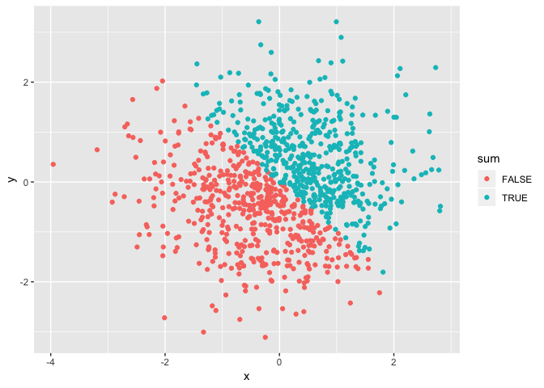
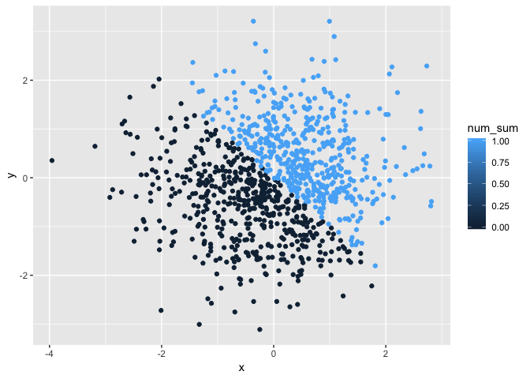
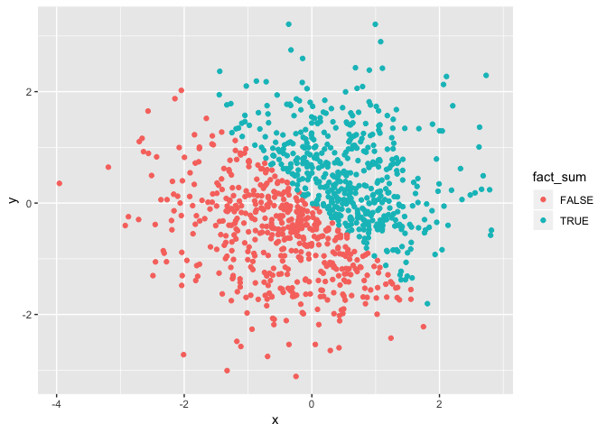

p8105\_homework\_1
================
Darwin Keung
2018-09-19

## Homework 1

### Problem 1

This problem focuses on variable types and coercion.

The chunks below creates a data frame comprised of:

  - A random sample of size 10 from a uniform\[0, 5\] distribution

  - A logical vector indicating whether elements of the sample are
    greater than 2

  - A (length-10) character vector

  - A (length-10) factor
vector

<!-- end list -->

``` r
## Creating the data frame. ## `runif` generates random uniformly distributed numbers
variable_df = tibble(
  vec_random = runif(10 , min = 0, max = 5),
  vec_logical = vec_random > 2,
  vec_char = c("A", "B", "C", "D", "E", "F", "G", "H", "I", "J"),
  vec_factor = factor(c("h", "e", "l", "l", "o", "w", "o", "r", "l", "d"))
)

## Taking the means of each variable in dataframe
mean(variable_df$vec_random)
## [1] 1.586043
mean(variable_df$vec_logical)
## [1] 0.3
mean(variable_df$vec_char)
## Warning in mean.default(variable_df$vec_char): argument is not numeric or
## logical: returning NA
## [1] NA
mean(variable_df$vec_factor)
## Warning in mean.default(variable_df$vec_factor): argument is not numeric or
## logical: returning NA
## [1] NA
```

The variable `vec_random` has class numeric and the variable
`vec_logical` has class logical. `mean` works on numeric and logical
vectors since there are quantities to use for the mean.

The variable `vec_char` has class character and the variable
`vec_factor` has class factor. `mean` does not work on character or
factor vectors - there are no numerical values to serve as input.

``` r
## Coercing our variables into numeric. 
as.numeric(variable_df$vec_logical)
as.numeric(variable_df$vec_char)
as.numeric(variable_df$vec_factor)
```

The logical and factor variable can be converted to numeric. But
character variable can’t be converted to numeric.

``` r
## convert character variable from character to factor to numeric; 
vec_char_to_factor = as.factor(variable_df$vec_char)
as.numeric(vec_char_to_factor)
```

    ##  [1]  1  2  3  4  5  6  7  8  9 10

``` r
## convert factor variable from factor to character to numeric. 
vec_fact_to_char = as.character(variable_df$vec_factor)
as.numeric(vec_fact_to_char)
```

    ## Warning: NAs introduced by coercion

    ##  [1] NA NA NA NA NA NA NA NA NA NA

Converting characters to factors assigns each character a catergorical
value, which then can be converted from a factor value to a numeric
value. Going from factor to character removes the catergorical value
(e.g. A = 1) and turns it into a character (A = “A”) which no longer can
be turned into a numeric value.

### Problem 2

This problem focuses on plotting and the use of inline R code.

The chunk below creates a data frame comprised of:

  - x: a random sample of size 1000 from a standard Normal distribution

  - y: a random sample of size 1000 from a standard Normal distribution

  - A logical vector indicating whether the x + y \> 0

  - A numeric vector created by coercing the above logical vector

  - A factor vector created by coercing the above logical vector

<!-- end list -->

``` r
p2_df = tibble(
  x = rnorm(1000),
  y = rnorm(1000),
  sum = x + y > 0,
  num_sum = as.numeric(sum),
  fact_sum = as.factor(sum)
)

## should I name it sum or no name just use x + y > 0.
```

  - The above dataframe, “p2\_df” is 1000, 5

  - The mean is 0.0386796 and the median is 0.0410082

*?Do I need to round or trincate? How can I do this?*

  - The proportion of cases for which the logical vector is `TRUE` is
    54.1

*I’m not sure if I should use the sum function here then devide by the
nrow(df). `mean` works if we are taking the proportion of 0 and 1
statements.*

``` r
## scatterplot of x and y
ggplot(p2_df, aes(x = x, y = y)) + geom_point(aes(color = sum))
```

<!-- -->

``` r
ggsave("hw1p2_scatterplot_xy.pdf", height = 4, width = 6)

## scatterplot using numeric
ggplot(p2_df, aes(x = x, y = y)) + geom_point(aes(color = num_sum))
```

<!-- -->

``` r
## scatterplot using factor variables
ggplot(p2_df, aes(x = x, y = y)) + geom_point(aes(color = fact_sum))
```

<!-- -->

*Comment on color scales*

The color scale of the scatterplot of x and y as well as the scatterplot
using factor variables uses True and False and a more distinct color
scheme. The numeric scatter plot color scale is a gradient assigning
colors for intervals between 0 and 1, but we only have 0 and 1 and thus
two colors shown. The color scale of the scatterplot of x and y as well
as the scatterplot using factor variables uses True and False and a more
distinct color scheme. The numeric scatter plot color scale is a
gradient assigning colors for intervals between 0 and 1, but we only
have 0 and 1 and thus two colors shown.
